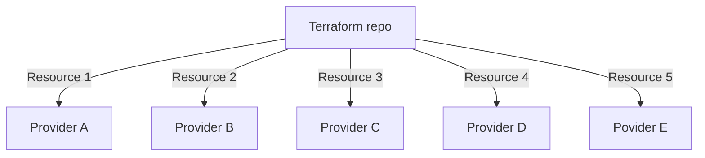

# Material

## Introduction

Terraform is a unique tool that allows you to manage your infrastructure as code. It is a tool for building, changing, and versioning infrastructure safely and efficiently. Terraform can manage existing and popular service providers as well as custom in-house solutions.

Terraform is more than jsut a tool to manage your cloud infrastructure. While it's one of the main use cases, Terraform could manage anything, it's quite flexible.

Before we start with the day 1 practice, it is strongly suggested to run `prepare.sh`:

```bash
chmod +x day1/prepare.sh
./day1/prepare.sh
```

## Configuration Language

Terraform uses HCL (HashiCorp Configuration Language) to define the infrastructure. HCL is a configuration language that is easy to read and write. It is a superset of JSON, so any valid JSON file is also a valid HCL file.

HCL is designed to be both human-friendly and machine-friendly. It is easy to read and understand, and it is easy to generate and parse.

## main.tf

`main.tf` is the default name for the main configuration file. It is the entry point for Terraform. It is the file that Terraform reads when you run `terraform apply` or `terraform plan`.

## ABC of Terraform

### Specifying the Provider

The provider is the service that Terraform will use to manage the infrastructure. The provider is the plugin that Terraform uses to manage resources. The provider is specified in the `provider` block.

"Global" configuration options are to be provided in the `terraform` block.

Providers are responsible for understanding API interactions and exposing resources. Providers are the plugins that Terraform uses to manage resources.
Providers are to be specified in the `required_providers` block in the `terraform` block.

Backend is the place where Terraform stores the state of the infrastructure. The backend is specified in the `backend` block.
For now we will be using `local` backend, which stores the state on the local machine.

```hcl
terraform {

  backend "local" {
    path = "terraform.tfstate"
  }

  required_providers {
    local = {
      source  = "hashicorp/local"
      version = "~> 2.4.0"
    }
    random = {
      source  = "hashicorp/random"
      version = "~> 3.6.0"
    }
  }
}
```

### Resources

Resources are the components of the infrastructure that Terraform will manage. Resources are to be specified with a keyword `resource` followed by the resource type and the resource name.

```hcl
resource "<resource_type>" "<resource_name>" {
  resource_argument1 = "value1"
  resource_argument2 = "value2"
}
```

### Data Sources

Data sources are used to fetch data that is not defined in the configuration. Data sources are to be specified with a keyword `data` followed by the data source type and the data source name.

```hcl
data "<data_source_type>" "<data_source_name>" {
  data_source_argument1 = "value1"
  data_source_argument2 = "value2"
}
```

### Dependencies

Terraform uses a graph to represent the infrastructure and to resolve dependencies. This means that Terraform can detect and handle cyclic dependencies. Terraform will return an error if it detects a cycle in the graph.

Depencies can be specified in two ways, for now we'll be using the implicit way.

```hcl
resource "resource_type" "resource_name" {
  resource_argument1 = "value1"
  resource_argument2 = "value2"
}

resource "resource_type" "resource_name2" {
  resource_argument1 = "value1"
  resource_argument2 = "value2"
  resource_argument3 = resource_type.resource_name.resource_argument1 # implicit dependency
}
```

## Providers

While Terraform knows how to work with graphs & resolve dependencies, it's providers' responsibility to manage resources. Providers are responsible for understanding API interactions and exposing resources. Providers are the plugins that Terraform uses to manage resources.

Providers can be thought of as Minecraft modes - each providing ways to interact with different resources.

We can think of Terraform using providers as a set of libraries with custom data types and functions.



Terraform decides which provider to use based on the resource type. 
Although I'm not aware of any popular providers having resources with the same name, it's possible to specify the provider explicitly for each resource.

```hcl
provider "parseltongue" {
  alias = "provider_a"
  version = "1.0.0"
  option1 = "value3"
  option2 = "value4"
}

provider "parseltongue" {
  alias = "provider_b"
  version = "1.0.0"
  option1 = "value1"
  option2 = "value2"
}

resource "provider_a_resource" "resource_name" {
  resource_argument1 = "value1"
  resource_argument2 = "value2"
  provider = parseltongue.provider_a
}
```

### Local Provider

The local provider is used to manage local files and directories. This can be useful for creating a local development environment or for managing local tasks.

Documentation: https://www.terraform.io/docs/providers/local/index.html

#### Local provider resources

- `local_file`

```hcl
resource "local_file" "example" {
  content  = "example"
  filename = "example.txt"
}
```

- `local_sensitive_file`

```hcl
resource "local_sensitive_file" "example" {
  content  = "example"
  filename = "example.txt"
}
```

#### Data sources:

- `local_file`

```hcl
data "local_file" "example" {
  filename = "${local_file.example.filename}"
}
```

- `local_sensitive_file`

```hcl
data "local_sensitive_file" "example" {
  filename = "${local_sensitive_file.example.filename}"
}
```

## Shell Provider

Shell provider is a wrapper to handle shell scripts as fully fledged resources in Terraform. It can be used to run scripts on the local machine or on a remote machine.


## Cycles

Terraform uses a graph to represent the infrastructure and to resolve dependencies. This means that Terraform can detect and handle cyclic dependencies. Terraform will return an error if it detects a cycle in the graph.

Cycles are not an expected behavior in Terraform.

Cycles happen when two resources depend on each other. It may be direct, when two resource depend on each other, or indirect, when two resources depend on each other through a third (or more) resource.

Example of cycle can be found in `day1/cycle` folder.

While `terraform graph` has an option `-draw-cycles` to draw cycles in the graph it wouldn't work in our case. It works **only** in case of *apply stage cycles*, when multiple resources depend on each other. It mainly happens with service object created at runtime. 


## Playing more with local provider

Example of local provider usage can be found in folders `day1/local` and `day1/cycle`.

## Visualizing the graph

Terraform has a built-in tool to visualize the graph
    
```bash
terraform graph | dot -Tsvg > graph.svg
```

This will create a graph of the infrastructure in the `graph.svg` file.

Rover is a tool that can be used to visualize the graph. It's a more advanced tool than `dot` and it's more user-friendly.

Rover is already installed in the environment if you ran `prepare.sh` script.

```bash
terraform plan -out plan.out
terraform show -json plan.out > plan.json
docker run --rm -it -p 9000:9000 -v $(pwd)/plan.json:/src/plan.json im2nguyen/rover:latest -planJSONPath=plan.json
```

## Exercises

1. Change file permissions of `day1/local/output` folder to 777.
2. Create a new file in `day1/local/output` folder.
3. Move a file into different folder - one level deeper than the current one.
4. Delete the file you created in step 2.
5. Delete the folder you created in step 3, move the file back to the original folder.
6. Change file permissions of `day1/local/output` folder to 755.
7. Copy the file you created in step 2 to `day1/local` folder under different name.
8. Create a script that would print a linux kernel version to stdout with `shell` provider.
9. Play with visualization of the graph - Rover is your best friend.
10. Create a skeleton of the directory for the project in the language of your choosing - nodejs, ts, golang, java etc. Be sure to create all you need, similar to nodejs express project generator. 

